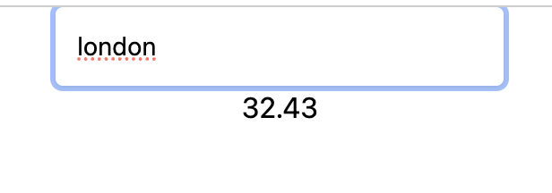

# 🌦️ Weather App

A simple weather application built with **React** and **OpenWeatherMap API**. This app allows users to search for a city and view the current temperature in Celsius.

## 🔍 Features

- Real-time weather data from OpenWeatherMap
- Temperature display in Celsius
- Error handling for invalid cities
- Responsive input field with smooth UI

## ⚙️ Technologies Used

- React.js
- Axios
- OpenWeatherMap API
- Tailwind CSS (for input styling)
- CSS (for layout and animations)

## 🖥️ Demo

You can see the app in action by running it locally (see below for setup) or check the screenshots:

### 📸 Screenshots

#### 🌇 City Weather Search




## 🚀 Getting Started

1. Clone the repository:

```bash
git clone https://github.com/your-username/weather-app.git
cd weather-app


## Available Scripts

In the project directory, you can run:

### `npm start`